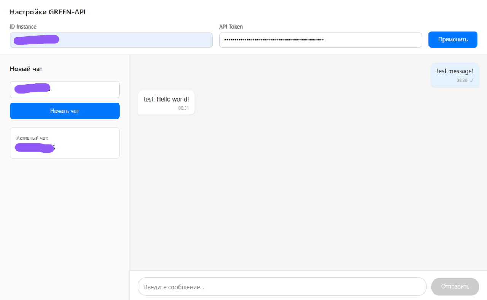

# MAX / Telegram Chat на React + Green-API

Веб-интерфейс чата для отправки и получения текстовых сообщений через GREEN-API.  
Разработан в рамках тестового задания на позицию **Frontend Developer (React)**.

🔗 **Живая демонстрация:** [https://green-api-deploy.netlify.app](https://green-api-deploy.netlify.app)  
🎥 **Видео-демо работы приложения:** [Ссылка на Loom / скринкаст](https://www.loom.com/share/4a4755eb94ec4efda366b363c7c3fa88)

📸 **Скриншот интерфейса:**

## 🚀 Возможности

- ✅ Отправка и получение **только текстовых** сообщений (строго по ТЗ)
- ✅ Получение сообщений в реальном времени через **Long Polling**
- ✅ **Оптимистичный UI**: мгновенное отображение исходящих сообщений с корректной обработкой статусов (`pending` → `sent` / `error`)
- ✅ **Telegram-специфика**: автоматическая нормализация номеров
- ✅ **Умная очистка очереди**: при создании чата старые уведомления из других диалогов автоматически удаляются, чтобы не блокировать получение новых сообщений
- ✅ **Строгая фильтрация**: сообщения отображаются только если они соответствуют текущему `chatId` и были получены *после* момента создания чата
- ✅ **Отзывчивый UX**: автоматическая очистка плашек ошибок при начале ввода, блокировка кнопок при невалидных данных

## 🛠️ Стек технологий

- **React 18** + **TypeScript**
- **Redux Toolkit** — управление глобальным состоянием
- **Vite** — сборка и dev-сервер
- **CSS** — стилизация (модульный подход, папки компонентов)
- **Green-API** — интеграция с мессенджерами

## 📦 Установка и локальный запуск

### 1. Клонирование репозитория
bash
git clone https://github.com/your-username/green-api-chat.git
cd green-api-chat

### 2. Установка зависимостей
npm install

### 3. Запуск dev-сервера
npm run dev

Приложение будет доступно по адресу: http://localhost:5173

### 📋 Инструкция по тестированию (для проверяющего)

Чтобы приложение корректно работало с вашим инстансом, выполните следующие шаги:

1. Получите idInstance и apiTokenInstance в личном кабинете Green-API.
2. Важно: Убедитесь, что при создании инстанса вы выбрали Telegram (или WhatsApp/MAX, но приложение оптимизировано под Telegram-формат).
3. Отсканируйте QR-код в личном кабинете через приложение Telegram на телефоне и дождитесь статуса "Авторизован".
4. Критически важно: Зайдите в настройки инстанса и убедитесь, что поле Webhook URL абсолютно ПУСТОЕ. Если там есть адрес, метод Long Polling возвращать сообщения не будет.
5. Откройте приложение, введите ваши idInstance и apiTokenInstance в верхней панели и нажмите "Применить".
6. Введите номер телефона собеседника в формате 79991234567 и нажмите "Начать чат".
7. Отправьте сообщение и проверьте получение ответа с телефона.

### 🧠 Архитектурные решения и вызовы

1. Проблема "забитой" очереди (FIFO)
Green-API хранит все уведомления инстанса в одной общей очереди за 24 часа. Если номер используется активно, очередь забита сообщениями из других чатов.
Решение: Реализована функция clearNotificationQueue, которая программно выгребает и удаляет старые уведомления перед открытием нового чата, гарантируя мгновенную доставку новых сообщений.
2. Коллизии при оптимистичном UI
При быстрой отправке сообщений генерация временных ID могла рассинхронизироваться между компонентом и Redux.
Решение: ID генерируется строго один раз в компоненте (temp-${Date.now()}) и передается в action, что гарантирует корректное обновление статуса (pending → sent) без "зависающих" песочных часов.
3. Кросс-платформенная нормализация номеров
Пользователь может ввести номер с 8, а API прислать его с 7.
Решение: Написана функция normalizePhone, которая приводит любой формат к единому стандарту 79XXXXXXXXX перед строгим сравнением chatId, что исключает ложные срабатывания фильтров.

### 📂 Структура проекта

Использован feature-based подход для масштабируемости:

src/
├── api/
│   └── greenApi.ts          # Клиент для запросов к Green-API
├── components/
│   ├── ChatSidebar/         # Боковая панель (ввод номера, очистка очереди)
│   ├── MessageInput/        # Поле ввода сообщения с защитой от двойного клика
│   ├── MessageList/         # Список сообщений с автоскроллом
│   └── SettingsPanel/       # Панель ввода учетных данных
├── hooks/
│   └── useChatPolling.ts    # Кастомный хук для Long Polling с фильтрацией
├── store/
│   ├── index.ts             # Конфигурация Redux
│   └── chatSlice.ts         # Слайс состояния чата
├── types/
│   └── index.ts             # TypeScript интерфейсы
├── App.tsx
└── main.tsx

👤 Автор
Семён
Telegram: @ssukhoii
Email: sammysoul96@gmail.com
GitHub: https://github.com/SSUHOY